# Configuração do Grafana para Monitoramento

Este guia descreve como configurar o Grafana para exibir métricas e logs utilizando as fontes de dados **Prometheus** e **Loki**.

---

## Configuração do Grafana:

- Primeiro, acesse o Grafana através do endereço `http://localhost:3000` (ou o endereço configurado no seu ambiente).

No menu lateral “Connections” vá em “Data Sources” e clique em Add data source

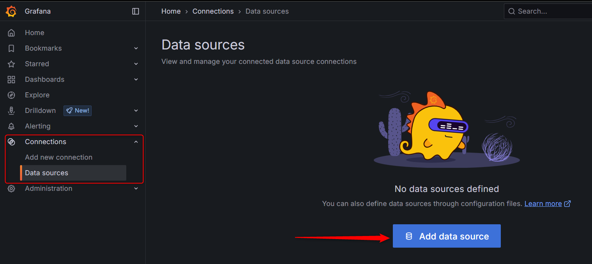

Selecione “Prometheus”

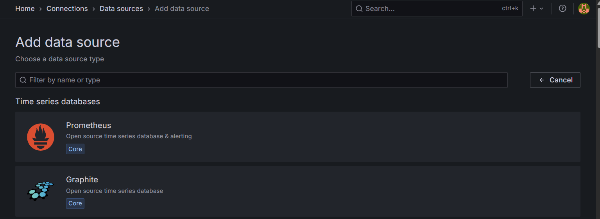

Em “Connection”, coloque a URL do servidor do Prometheus, no caso do servidor configurado no “docker-compose”, será `http://prometheus:9090`.
Em seguida clique em “Save & test” no fim da página.

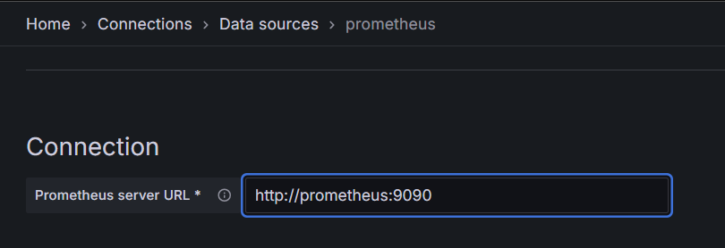

Após configuração da conexão com Prometheus, clique em “Add new connection” ainda no menu lateral “Connections”, procure e clique em “Loki”.

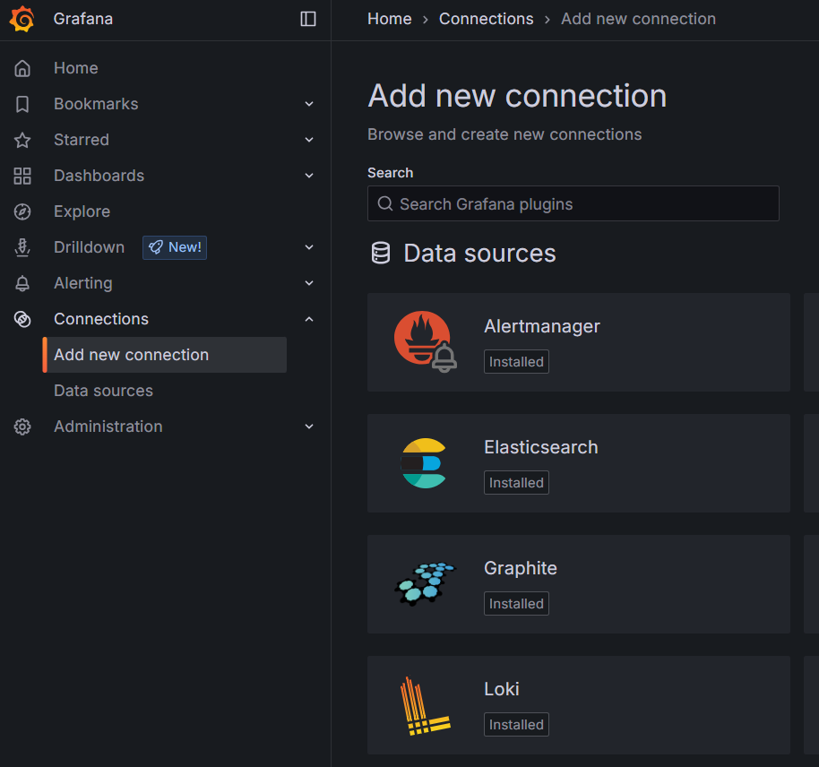

Em seguida, clique no botão “Add new data source”.

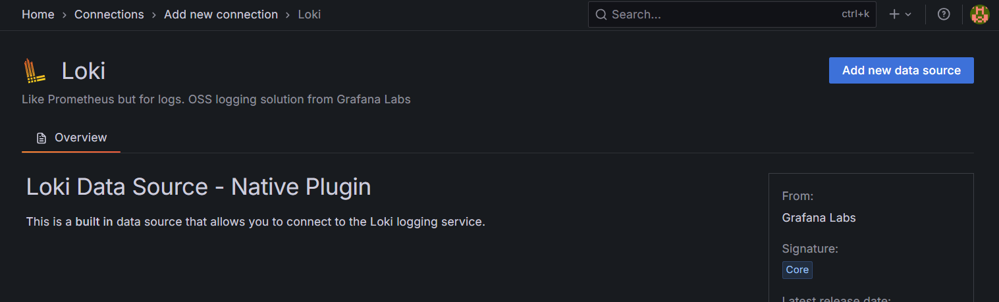

Em “Connection”, coloque a URL do servidor do Loki, no caso do servidor configurado no “docker-compose”, será `http://loki:3100`.
Em seguida clique em “Save & test” no fim da página.

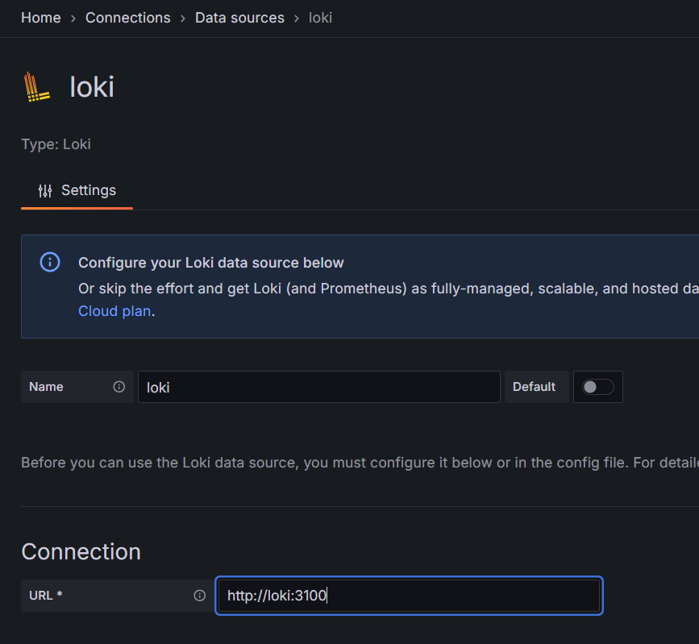

Feita a configuração dos Data sources, clique no menu lateral “Dashboards” e no canto superior direito clique em “New” e em seguida “Import”.

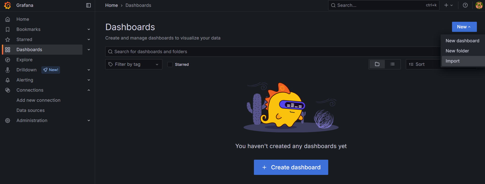

Neste ponto vamos importar um Dashboard que está incluso no diretório “monitoring” do repositório. Clique em “Upload dashboard JSON file” e selecione o arquivo “OpenTelemetry dotnet webapi  fiapCloudGame-1753534373730.json”

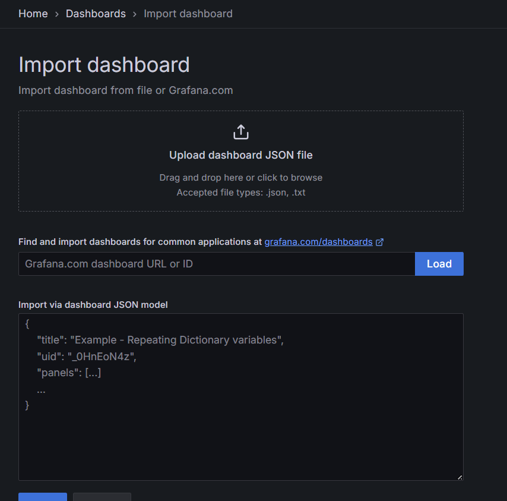

Em seguida, clique em “Import”.

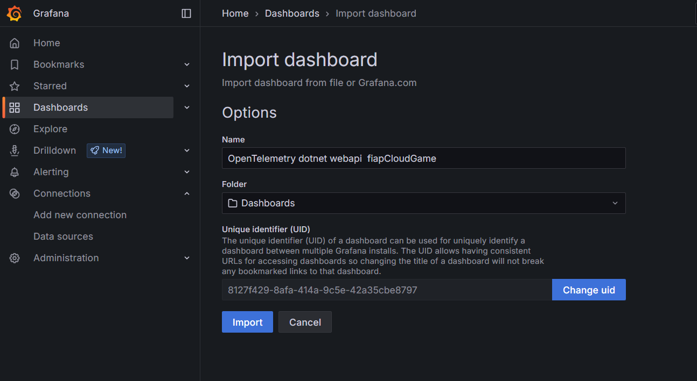

A partir desse momento, durante o uso da aplicação os dados serão coletados e exibidos na Dashboard carregada.

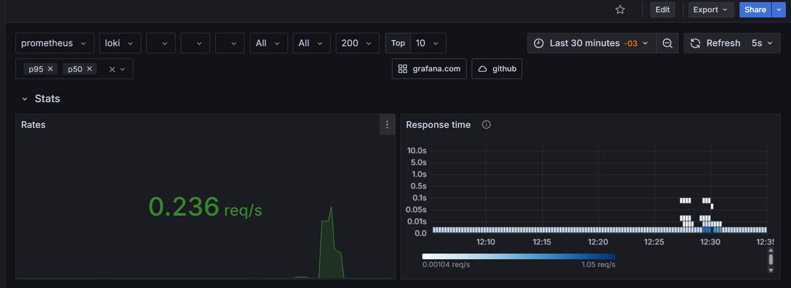

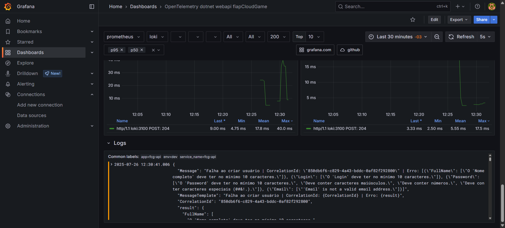
